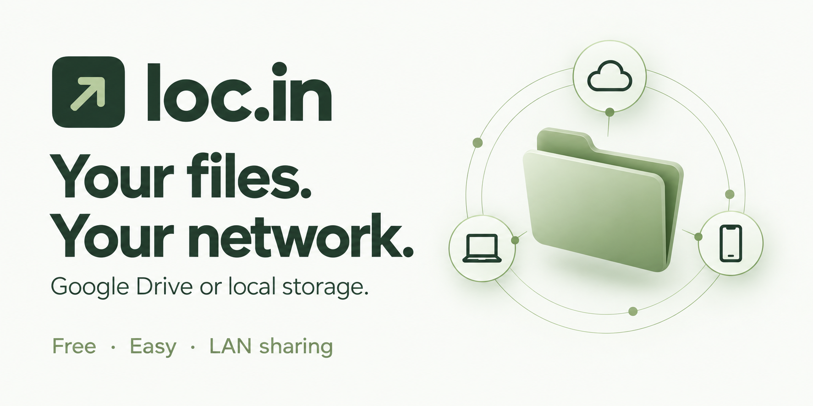

# loc.in

**Free local file sharing. Easy access. Your LAN, your control.**

Connect Google Drive or select local storage, configure a name, and share a folder across your LAN. Access files from a phone, tablet, or computer using a browser. Control the gateway from one simple host app.

**Install. Choose storage. Connect. Share.**

loc.in adds no application subscription fee. Google Drive storage limits, internet access, and any Google service charges still apply.

| What you want to do | How loc.in helps |
| --- | --- |
| **Connect** | Sign in to Google Drive through Google OAuth. |
| **Configure** | Choose a shared folder and a custom local address. |
| **Share** | Make a selected Drive or local folder available on your LAN. |
| **Access** | Browse, upload, and download in a browser without installing a client app. |
| **Control** | Start or stop sharing and see connected devices and transfers. |

loc.in turns one Windows computer into a file gateway for devices on the same local network. The host has Home, Files, Devices, Settings, and About; other devices need only a browser with Files and Transfers.

An animated opening screen brings the folder and network artwork to life while loc.in loads. It works entirely from local assets, respects reduced-motion preferences, and provides a retry screen if the host takes too long to respond.

## Choose your storage

Both storage choices use the same setup layout and the same automatic `.local` address. A fresh local installation has no selected storage folder; choose an existing folder to serve before starting. An unavailable-folder warning appears only if a previously selected folder can no longer be accessed.

| Option | Where files live | Internet needed? |
| --- | --- | --- |
| **Cloud · Google Drive (recommended)** | Your selected Google Drive folder | Yes, for file operations |
| **Local storage** | An existing folder you select on the host computer | No; only the LAN connection is needed |

Both options share files over the LAN. “Cloud” describes where files are stored; it does not make the gateway publicly accessible. One storage option is active at a time.

For local storage:

1. Open loc.in and select **Local storage** in setup or Settings.
2. Click **Choose folder**, then **Browse folders** in the desktop app. In browser mode, paste an absolute folder path from File Explorer, such as `C:\Users\You\Shared`.
3. Choose **Share this folder**, configure your local name, and click **Start loc.in**.
4. On another LAN device, open the address shown on Home. The same browsing, uploads, downloads, and transfer progress work without Google sign-in.

To switch storage, stop the service and let transfers finish, then open Settings. Each storage choice remembers its folder; switching never copies, moves, or deletes your files. Google Drive remains the default for new installations. The host must stay awake for either option.

Local storage rejects symbolic links, Windows junctions/reparse points, hard-linked files, reserved filenames, and requests outside the selected folder. Uploading a duplicate filename returns a rename-and-retry message instead of replacing an existing file. Choose a regular folder rather than a whole disk or a linked folder.

## Development build status

This repository implements the MVP and includes a Windows desktop launcher, tray controls, a portable executable build, and an Inno Setup installer definition. This build is intentionally **unconfigured for Google OAuth**. No account is connected, and no sample content is presented as real user data.

Before real Drive access, import a Google Desktop OAuth client through the installed app, or bundle the publisher's configuration as described below. Automated backend and browser tests use a synthetic Drive adapter only under `tests/`; live Google consent, real large-file transfers, and discovery from a second physical device must still be verified before release.

## Set up Google Drive in the installed app (v1.3.0)

If you see a message about missing Google configuration, the installer has no publisher OAuth client bundled. You do not need to install Python or rebuild the app:

1. Open [Google Cloud Console](https://console.cloud.google.com/) and create/select a project.
2. Open **APIs & Services → Library**, find **Google Drive API**, and enable it.
3. Open **Google Auth platform** and complete **Branding** and **Audience**. For **External / Testing**, add your Google email under Test users. Eligible Workspace projects may choose Internal; your Workspace administrator may need to allow the OAuth app.
4. Under **Data Access**, add `https://www.googleapis.com/auth/drive` so the app can work with existing Drive folders.
5. Under **Clients → Create client**, choose **Desktop app**, name it `loc.in`, and download the JSON file. Do not choose Web application or Service account; no custom-domain redirect URL is needed.
6. In loc.in, choose **Settings → Import Google JSON** and select that downloaded file. The same import is available from the first-run Connect dialog and About. The configuration is validated and kept in Windows Credential Manager. No restart or rebuild is needed.
7. Click **Connect Google Drive**, finish Google's consent flow in your browser, and return to loc.in.
8. Enter a local name such as `vault`, choose **My Drive / loc.in** or an existing folder, then click **Start loc.in**.
9. Keep the host awake. On another device on the same allowed subnet, open your configured address, such as `http://vault.local`, or scan the QR code on Home. Google Drive also needs internet access.

Google's current workflow is documented in [Create access credentials](https://developers.google.com/workspace/guides/create-credentials). Do not send your JSON file, client secret, or refresh token in chat.

## Google sign-in blocked: Error 403 / access_denied

If Google says **“loc.in has not completed the Google verification process”** and **“only developer-approved testers”**, your selected Google account needs access to the OAuth project's test audience. This is a Google Cloud setting; reinstalling loc.in or changing the LAN address will not fix it.

1. Open [Google Auth platform → Audience](https://console.cloud.google.com/auth/audience).
2. Select the **same Google Cloud project that created the Desktop app JSON you imported into loc.in**. Adding a tester to another project has no effect.
3. Under **Test users**, choose **Add users**, enter the exact email you will use to connect Drive, and save.
4. Return to loc.in and click **Connect Google Drive** again. In Google's account chooser, select that same email. Being the project owner or an IAM member does not replace adding the account as a test user.
5. If access is still blocked, check the OAuth client shown in Google's error details against **Google Auth platform → Clients** in that project. For a managed Workspace account, ask the administrator whether organizational app-access policies also block it.

You can test with approved test users without first completing public verification. Public distribution with this app's restricted Drive scope requires the applicable Google verification; switching the audience to Production is not a substitute. See [Google's audience settings](https://support.google.com/cloud/answer/15549945) and [verification exceptions for testing/internal apps](https://support.google.com/cloud/answer/13464323).

## Connect from another device

Start loc.in, join the same Wi-Fi or LAN on your phone, tablet, or computer, and open the `.local` address shown on Home. No router configuration or client installation is required.

If your device cannot resolve the name, use the direct IP link or **Share / QR code** on Home. The QR code contains only the local IP URL, never credentials. Keep any displayed port suffix. The host must stay awake and the network must allow devices to communicate; guest isolation, VPNs, and firewall restrictions can prevent access. After changing networks, stop and start loc.in to refresh its address.

The gateway tries port 80, then 8000 if port 80 is unavailable or needs privileges. Both the local name and IP URL include the actual port. Do not run as administrator just to remove the suffix.

Optional: an administrator can map `vault.loc.in` to the host IP in internal DNS. This is not required for normal use and is not automatically configured by loc.in.

Clients use a browser on Windows, macOS, Linux, Android, or iOS. The bundled installer is for Windows hosts; other desktop host platforms require their own packaging and validation.

## Access inside an organization

Yes, loc.in can serve an office LAN, but access is based on **network reachability and the host's selected local subnet**, not organization or employee identity. Devices on that allowed subnet can browse, upload and download unprotected content. Protected folders require their folder password. There is currently no client login, device approval, or employee verification.

Other VLANs, branches, routed subnets, guest networks and VPN clients are not automatically included. The Windows installer permits local-subnet traffic on Private and Domain profiles; organizational firewall/group policies can still override it. The app does not expose an internet-facing service. Local file traffic uses HTTP, so use a trusted network. Choosing Internal in Google's OAuth audience controls who may authorize the Google account; it does **not** add employee authentication to the LAN client.

## Run from source

Use Python **3.11 or newer** on Windows. Node is not required to run or build the frontend. The current code also works on Python 3.10, which was available for local development; CI targets 3.11.

```powershell
py -3.11 -m venv .venv
.\.venv\Scripts\python.exe -m pip install -r requirements-dev.txt
.\.venv\Scripts\python.exe run.py
```

The native host window opens automatically. If the WebView2 runtime is unavailable, the launcher falls back to the default browser. To choose the browser explicitly:

```powershell
.\.venv\Scripts\python.exe run.py --browser
```

The launcher supplies an ephemeral host session. Opening `http://127.0.0.1:4028` manually in a new browser profile does not grant host controls. Open the application or use its tray menu instead. Closing the native window hides it in the tray; **Exit** stops the application. If a tray cannot be created, closing the window exits.

## Repository and branch workflow

Repository: [nikh-iam/loc.in](https://github.com/nikh-iam/loc.in).

```text
feat/<change> → dev → release/<version> → master
```

| Branch | Purpose | Merge target |
| --- | --- | --- |
| `feat/<change>` | Work on one feature or fix, starting from `dev`. | `dev` |
| `dev` | Integrate and test ongoing development. | `release/<version>` |
| `release/<version>` | Stabilize and validate a release candidate. | `master` |
| `master` | Final, approved release history. | Start future development from this history. |

`feat/` and `release/` are prefixes, not literal branch names. Git names cannot end in `/`. Use `dev` as the shared integration branch; short-lived `dev/<name>` branches, if needed, merge into `dev` first.

Create feature branches from the integration branch:

```powershell
git switch dev
git pull --ff-only origin dev
git switch -c feat/my-change
# Commit the change, then publish the feature branch:
git push -u origin feat/my-change
```

Use pull requests to promote changes in the order above. Create `release/<version>` from the tested `dev` commit, then merge the approved release into `master`. Bring any release-only fixes back into `dev` before starting the next cycle. Do not push feature work directly to `master`.

The branch-flow workflow checks PR source/target names. Repository maintainers should require that check and the Windows build before merging, and protect `dev`, `release/*`, and `master` against direct pushes. Workflow files alone do not enable GitHub branch protection. Initial repository branches share a baseline commit; creating that baseline does not certify the development build as a production release.

## Publisher Google OAuth setup

For a public release, bundle the publisher's configuration so end users can simply click Connect. For development or an organization's own deployment, the in-app import described above avoids rebuilding.

1. Create a Google Cloud project and enable **Google Drive API**.
2. Configure the OAuth consent screen. In testing mode, add the accounts that will test this app.
3. Create an OAuth client of type **Desktop app** and download its JSON configuration.
4. Save it as `oauth-client.json` at the repository root, or set `LOCIN_OAUTH_CLIENT` to its absolute path when running from source. This file is gitignored.
5. Build the application. The build bundles the root `oauth-client.json`; users then click **Connect Google Drive**, authenticate in their system browser, choose a folder and local name, and click **Start loc.in**.

Configuration lookup prefers an imported OS-vault configuration, then `LOCIN_OAUTH_CLIENT`, then the bundled file. Only a Google Desktop client using the expected Google authorization endpoints is accepted.

The app uses Google's desktop loopback redirect (`http://127.0.0.1:4028/auth/callback`), PKCE, and a one-use, ten-minute state value. Google access and refresh tokens are stored through the operating system credential vault (`keyring`), not SQLite or the browser. Account email is displayed only when returned by Google.

Selecting arbitrary existing Drive folders requires the `https://www.googleapis.com/auth/drive` scope in this implementation. It is a restricted scope: obtain the applicable Google verification before distributing a production OAuth application. The gateway itself validates folder ancestry on each file operation, but Google's authorization is account-wide, not limited to that folder. Shortcuts are not followed. See [Google's desktop OAuth guide](https://developers.google.com/identity/protocols/oauth2/native-app) and [Drive scope documentation](https://developers.google.com/workspace/drive/api/guides/api-specific-auth).

Do not paste tokens into source files or logs. The desktop OAuth client configuration identifies the application; users' refresh tokens are separate and are never bundled.

## Local network behavior

- Host controls bind only to `127.0.0.1:4028` and require the launcher's session token. OAuth and settings endpoints do not exist on the LAN app.
- Start binds to the active private IPv4 adapter and advertises the chosen `.local` name using mDNS.
- The gateway uses port 80 when available, otherwise 8000. All displayed links use the actual port.
- Home shows a direct IP fallback and QR code for devices without local discovery.
- The installer adds program-specific Windows Firewall rules for Private/Domain profiles and local-subnet peers only. It does not change router settings, configure DNS, or enable port forwarding.
- Client isolation and firewall rules can prevent access even with correct DNS. Use a network that allows client-to-host communication. Windows must use the Private or Domain profile for the installer firewall rules.
- After changing Wi-Fi/adapters or the computer's IP address, stop and restart the gateway so it binds and advertises the new address. Multiple routed subnets and IPv6 are outside this version's scope.
- Internet loss does not prevent the local interface or status pages from loading. Drive operations show a recoverable error. Local storage continues to browse and transfer files without internet access.

## Files and transfers

### Password-protected folders

Stop sharing and finish active transfers before changing protection. In **Files**, choose **Protect folder** beside a folder; in **Settings**, choose **Protect shared folder** to protect the whole shared root. Set a password of at least eight characters. **Manage password** lets the host replace the password or remove protection.

Visitors enter the password to access a protected folder. Protection covers descendant folders, direct downloads, folder creation, uploads, and upload-resume requests for both Google Drive and local storage. Nested protected folders may require more than one password. An unlock lasts 30 minutes for that browser/device; password changes revoke prior unlocks. Password guesses are limited to ten attempts per visitor in five minutes. Passwords are stored as salted scrypt hashes, not plaintext.

The host retains access through its authenticated control interface and can reset a forgotten password. This is gateway access protection, not disk encryption or a Google Drive permissions change. Local traffic still uses HTTP: use a trusted LAN. Folder passwords do not protect against someone who can intercept that traffic or access the host directly.

Only the selected root and its descendants are reachable through client file APIs. Folder listings load up to 100 items and support a next-page cursor. Search applies to the **current folder**, including pages of results. Clients can upload, download, and create folders. Delete is intentionally not enabled in this version.

Uploads use browser `Blob.slice` and **4 MiB** chunks sent to the host. In Google Drive mode, the host forwards them to a resumable session without writing upload contents to disk or exposing Google's session URL. In local mode, chunks go to an OS-managed temporary file in the chosen folder, then a bounded-memory copy creates the completed file without overwriting an existing name. Finalization can temporarily need twice the file size in free disk space. Temporary files are hidden from gateway listings and removed on completion, cancellation, timeout, or process exit. A host interruption during the final copy can leave a partial destination file; remove or rename it before retrying. Uploaded contents never enter SQLite. Empty files are supported. Three uploads/downloads may be active across all devices; the browser queues its own selected files sequentially. A fourth device transfer gets a clear retry message. See [Google's resumable-upload protocol](https://developers.google.com/workspace/drive/api/guides/manage-uploads).

Downloads stream in 4 MiB blocks. Google Docs export to PDF, Sheets to XLSX, and Slides to PPTX; Google's export limits still apply. Shortcuts and other native Google file types are not downloadable here. A completed download means the host finished streaming to the browser, not that the user selected a final disk location.

Uploads can be paused, resumed, or cancelled between chunks from Transfers. Transient connection failures and Drive rate limits trigger up to five retries with increasing delays. Before retrying, the host checks the acknowledged byte offset, including when Drive received a chunk but its reply was lost. Only remaining bytes are sent; progress reflects acknowledged data. After retries are exhausted, click **Resume upload**.

After reloading the same browser tab, select the **same unchanged file** in the same folder to resume; the browser remembers the session ID using the file name, size, and last-modified timestamp. File contents and Google session URLs are not saved in browser storage. Keep the host running, use the same gateway address/browser/device, and resume within **ten minutes of inactivity**. Closing the tab, changing the file, changing device identity/IP, stopping/restarting the service, or an expired Google session may require starting again. This is not a persistent upload queue across host restarts. Up to three unfinished uploads/downloads hold transfer slots; cancel unused paused uploads to free capacity.

Download cancellation uses the browser's download controls. Transfer history persists locally, while in-progress entries become Failed after a host restart. Clients see their own transfer history; the host sees all activity.

Devices appear after recent API communication and expire from the active list after 60 seconds. Names are inferred from browser user-agent strings, and identity combines IP and user agent; this is intentionally approximate and does not scan the Wi-Fi network. Background browser tabs may become inactive.

## Windows packaging

Install [Inno Setup 6](https://jrsoftware.org/isinfo.php) on the build machine. Users of the resulting package do not install Python.

```powershell
# Unconfigured portable preview (no Inno Setup required):
.\packaging\build.ps1 -DevelopmentBuild -SkipInstaller

# Unconfigured installer for development:
.\packaging\build.ps1 -DevelopmentBuild

# Configured release: requires oauth-client.json at the project root.
.\packaging\build.ps1
```

Outputs:

- `dist/locin/locin.exe` — portable app; keep the entire `dist/locin` directory together.
- `release/loc.in Setup.exe` — installer, after compiling with Inno Setup.

The build runs tests, bundles Python using PyInstaller, and checks the resulting windowless executable with an isolated startup test before compiling the installer. The installer creates shortcuts, installs the private-network firewall rules, and offers to launch the app unelevated. Uninstall cleanup removes the current Windows account's loc.in startup entry, saved Google credentials, database, and app-managed WebView cache. Code signing, OAuth verification, and testing on a clean Windows machine are release tasks; development artifacts are unsigned.

`.github/workflows/windows.yml` tests and builds an **unconfigured** portable preview on Python 3.11. It does not publish a production release or consume account credentials.

## Tests

```powershell
.\.venv\Scripts\python.exe -m pytest -q
node --check frontend/app.js

# Optional real-browser smoke suite, using installed Microsoft Edge:
.\.venv\Scripts\python.exe -m pip install playwright
.\.venv\Scripts\python.exe -m tests.browser_smoke

# Exercise launcher/server startup without opening a desktop window:
.\.venv\Scripts\python.exe run.py --smoke-test
```

Tests cover real temporary local folders, storage switching, local upload cleanup and collision protection, host authentication, subnet and origin checks, folder confinement, moved/trashed parents, chunk bounds and offsets, empty uploads, cancellation, capacity limits, private transfer histories, streaming download cleanup, settings, OAuth state, pagination, and offline/disconnected behavior. The browser suite exercises onboarding, draft retention, service controls, folders, search, upload/download, settings, desktop/mobile layouts, and client navigation. It runs an isolated loopback server with synthetic Drive content and real temporary local files and does not contact Google or advertise on the LAN. Screenshots go to `data/screenshots/`.

## Layout and local data

```text
app/
  main.py        Host/client application factories, OAuth, settings
  drive.py       Google Drive HTTP adapter and folder confinement
  local.py       Local folder storage, path confinement, temporary uploads
  files.py       Listings, folders, chunked uploads, streamed downloads
  transfers.py   Concurrency and transfer history
  devices.py     Recently active clients
  network.py     Gateway lifecycle, adapter selection, HTTP listener
  database.py    SQLite settings/devices/transfers
  config.py      Paths and validation
  startup.py     Windows sign-in startup option
frontend/        Local HTML, CSS, JavaScript, SVG; no CDN dependencies
packaging/       PyInstaller and Inno Setup scripts
tests/           Isolated backend and browser tests
run.py           Native desktop window and system tray
```

Settings, device metadata and transfer history live in `%LOCALAPPDATA%/loc.in/locin.db`. Override with `LOCIN_DATA_DIR` for isolated development. Uploaded contents are never stored in the database; local-mode files live in your selected shared folder. OAuth credentials are kept in the OS credential vault under service `loc.in`, account `google-oauth`; imported desktop client configuration uses account `google-client`. Uninstalling removes this app-owned state for the Windows account running the uninstaller. Shared local folders, uploaded files, Google Drive content, and unknown user files are preserved. Other Windows accounts must remove their own app data and credentials; an elevated uninstaller running as a different administrator does not have access to the original account's credential vault. Exit loc.in from its tray menu before uninstalling. Reinstalling after cleanup starts with no selected local folder.

## Before production release

- Supply and verify the publisher OAuth application, then test real sign-in, refresh, revoked access and reconnection.
- Test the automatic .local name and direct IP/QR fallback from a physical phone and laptop, including port 80 contention.
- Validate a multi-gigabyte upload/download, internet interruption, cancellation and several concurrent devices against real Drive.
- Build with supported Python, sign the app/installer, and test install, tray behavior, downloads, startup and uninstall on clean Windows 10/11 with WebView2.

Optional device approval, device renaming, file deletion, recursive search, multiple accounts and advanced administration are not part of this MVP.

### File previews

Click a file to preview PNG, JPEG, GIF, WebP, plain text, CSV, or JSON files up to 10 MB. Other formats, including PDF and Office documents, can be downloaded. Folder passwords also protect previews. Text is displayed as text, never executed as HTML. The desktop window opens maximized; the sidebar and desktop icon share the same logo artwork.
